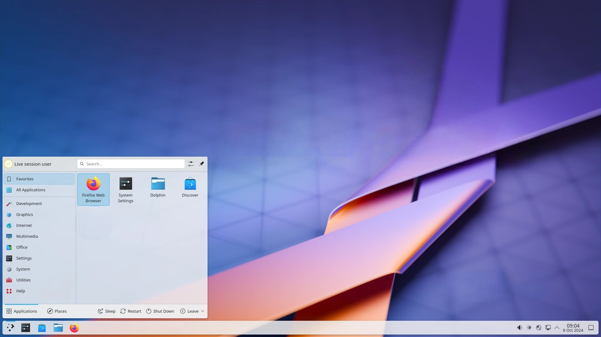
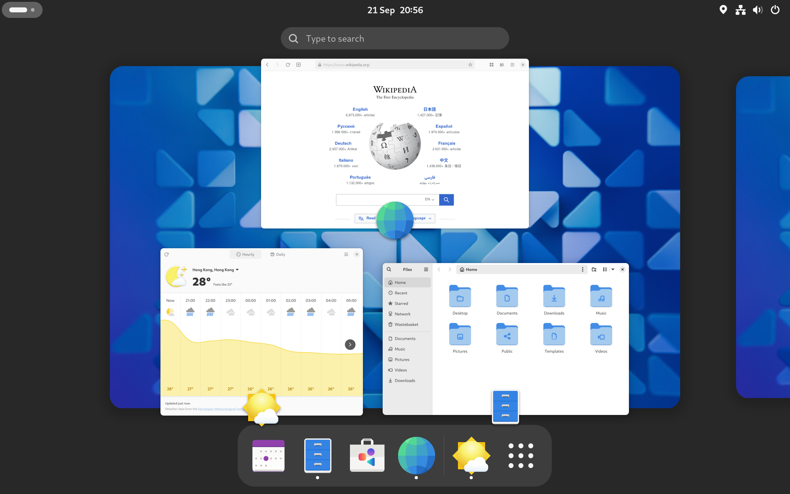
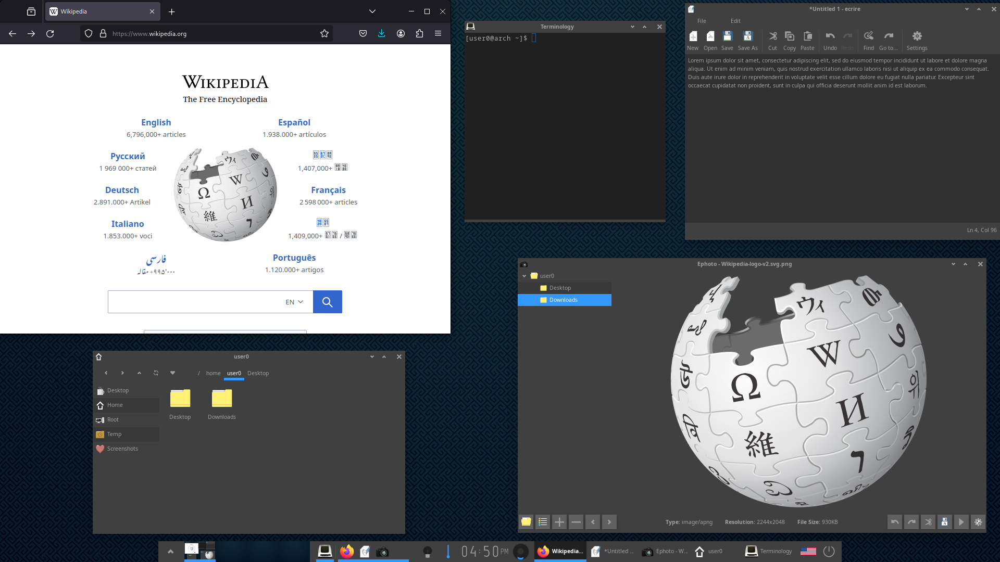
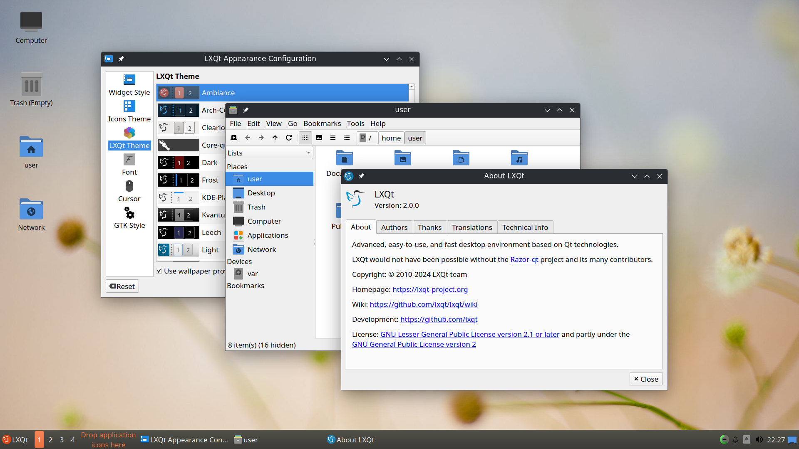
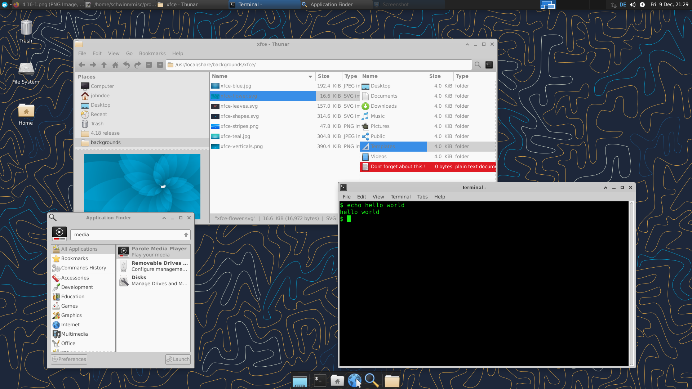
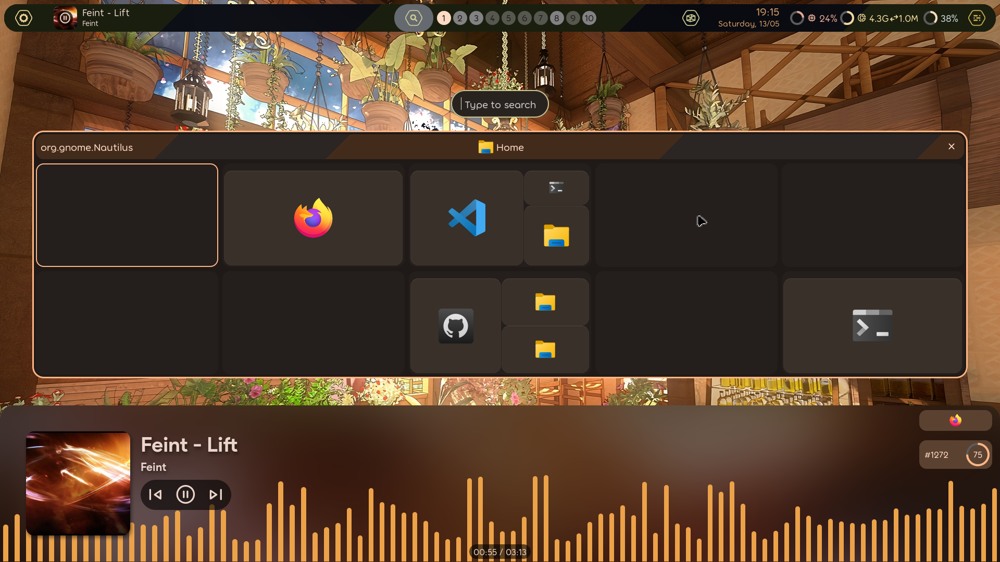
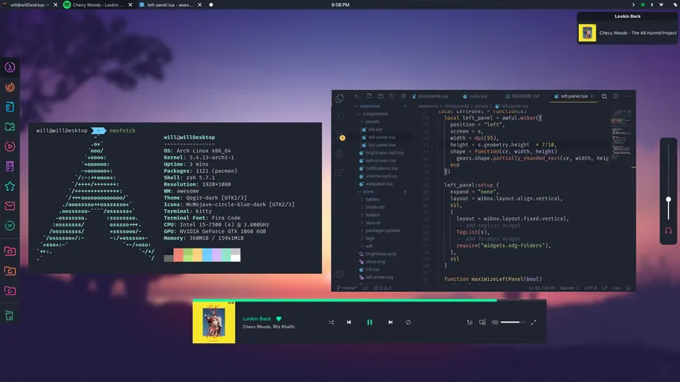
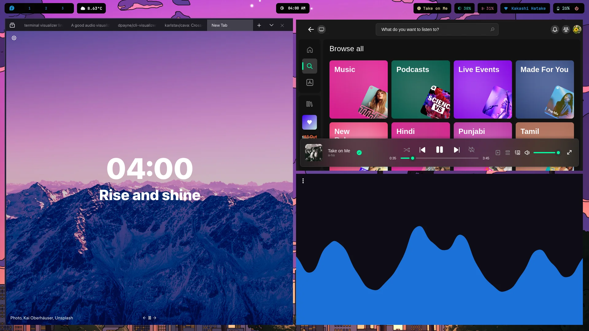

## What is a window manager?

Put simply, a window manager organises you windows and decides how GUI elements are placed.
There are two main types of Window Managers (WMs):
- Stacking Window Managers (SWMs)
- Tiling Window Managers (TWMs)

An SWM is your vanilla window manager. You use your mouse to stack, arrange and rearrange windows. There's normally a system tray, and a button to minimise all apps to it.

A TWM is a bit more advanced tham an SWM. Their main focus is to increase productivity by keeping your hands on the keyboard.
→ There's keybinds for all functions, however, they have a much steeper learning curve.

## My advice?

Use a stacking window manager if you use the Nano text editor, and use a tiling window manager if you use a Vi-based or the Emacs text editor.

## Different SWMs

This section will cover Stacking Window Managers.

<details>
  <summary><h4>KDE Plasma</h4></summary>



To just install KDE Plasma, use the below command:
```
sudo pacman -S plasma
```

The packages below provide a more integrated desktop experience for KDE Plasma

```
sudo pacman -S konsole dolphin ark kwrite kcalc spectacle krunner partitionmanager
```

<table>
  <tr> 
    <th>Packages</th>
    <th>Description</th>
  </tr>
  <tr>
    <td>plasma</td>
    <td>KDE Plasma window manager.</td>
  </tr>
  <tr>
    <td>konsole</td>
    <td>Terminal.</td>
  </tr>
  <tr>
    <td>dolphin</td>
    <td>File manager.</td>
  </tr>
  <tr>
    <td>ark</td>
    <td>Archiving tool.</td>
  </tr>
  <tr>
    <td>kwrite</td>
    <td>Text editor.</td>
  </tr>
  <tr>
    <td>kcalc</td>
    <td>Scientific calculator.</td>
  </tr>
  <tr>
    <td>spectacle</td>
    <td>Screenshot capture utility.</td>
  </tr>
  <tr>
    <td>krunner</td>
    <td>Quick drop-down desktop search.</td>
  </tr>
  <tr>
    <td>partition manager</td>
    <td>Disk & partition manager.</td>
  </tr>
</table>
</details>

<details>
  <summary><h4>GNOME</h4></summary>



To install GNOME, use the below command:
```
sudo pacman -S gnome gnome-extra
```

<code>gnome-extra</code> is for a more integrated desktop experience, and includes a bundle of apps to facilitate that.
</details>

<details>
  <summary><h4>Enlightenment</h4></summary>



Install Enlightenment, as shown below:
```
sudo pacman -S enlightenment ecrire ephoto evisum rage terminology
```

The packages that aren't `enlightenment` provide a more integrated desktop environment.

<table>
  <tr> 
    <th>Packages</th>
    <th>Description</th>
  </tr>
  <tr>
    <td>enlightenment</td>
    <td>Enlightenment window manager</td>
  </tr>
  <tr>
    <td>terminology</td>
    <td>Terminal.</td>
  </tr>
  <tr>
    <td>ecrire</td>
    <td>Text editor.</td>
  </tr>
  <tr>
    <td>evisum</td>
    <td>Process viewer, similar to Task Manager on Windows</td>
  </tr>
  <tr>
    <td>ephoto</td>
    <td>Photo viewer.</td>
  </tr>
  <tr>
    <td>rage</td>
    <td>Video viewer.</td>
  </tr>
</table>

</details>

> Note: Wayland support on LXQt and XFCE is a bit shaky.

<details>
  <summary><h4>LXQt</h4></summary>



To install LXQt, use the below command:
```
sudo pacman -S lxqt
```
</details>

<details>
  <summary><h4>XFCE</h4></summary>



To install XFCE, use the below command:
```
sudo pacman -S xfce xfce4-goodies
```

<code>xfce4-goodies</code> is for a more integrated desktop experience, and includes a bundle of apps to facilitate that.

</details>

## Different TWMs

> Images used are meant to demonstrate their customisability and do not reflect what they look like out-of-the-box.

<details>
  <summary><h4>Hyprland</h4></summary>



To install hyprland, use the below command:
```
sudo pacman -S hyprland
```
</details>

> Note: Awesome does not support Wayland.

<details>
  <summary><h4>Awesome</h4></summary>



To install AwesomeWM, use the below command:
```
sudo pacman -S awesome
```

Create a new configuration directory:
```
mkdir ~/.config/awesome
```

And copy the default config file:
```
cp /etc/xdg/awesome/rc.lua ~/.config/awesome/rc.lua
```

</details>

<details>
  <summary><h4>Sway</h4></summary>



Install Sway, as shown below:
```
sudo pacman -S sway swaylock swaybg swayidle
```

</details>

<details>
  <summary><h4>river</h4></summary>


To install river, use the below command:
```
sudo pacman -S river
```

</details>
